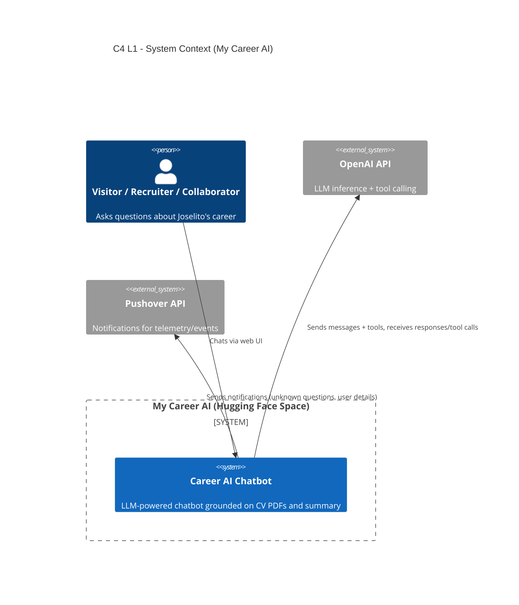

# 🏗 Architecture Overview

This document describes the architecture of the AI Career Agent
using the C4 model (Context → Container → Component).

---

```mermaid
C4Context
title C4 L1 - System Context (My Career AI)

Person(user, "Visitor / Recruiter / Collaborator", "Asks questions about Joselito's career")

System_Boundary(app, "My Career AI (Hugging Face Space)") {
  System(system, "Career AI Chatbot", "LLM-powered chatbot grounded on CV PDFs and summary")
}

System_Ext(openai, "OpenAI API", "LLM inference + tool calling")
System_Ext(pushover, "Pushover API", "Notifications for telemetry/events")

Rel(user, system, "Chats via web UI")
Rel(system, openai, "Sends messages + tools, receives responses/tool calls")
Rel(system, pushover, "Sends notifications (unknown questions, user details)")

```
