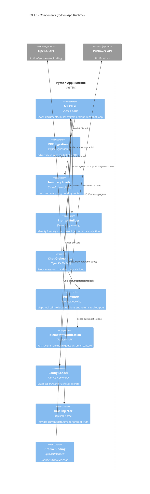

```mermaid
C4Component
title C4 L3 - Components (Python App Runtime)

System_Boundary(py, "Python App Runtime") {

  Component(me, "Me Class", "Python class", "Loads documents, builds system prompt, runs chat loop")
  Component(pdf, "PDF Ingestion", "pypdf.PdfReader", "Extracts text from multiple CV PDFs")
  Component(summary, "Summary Loader", "Pathlib + read_text()", "Loads summary.txt grounding context")
  Component(prompt, "Prompt Builder", "Prompt engineering", "Identity framing + document injection + date injection")
  Component(chat, "Chat Orchestrator", "OpenAI API client", "Sends messages, handles tool_calls loop")
  Component(toolrouter, "Tool Router", "handle_tool_call()", "Maps tool calls to local functions and returns tool outputs")
  Component(telemetry, "Telemetry/Notification", "Pushover API", "Push events: unknown question, email capture")
  Component(config, "Config Loader", "dotenv + env vars", "Loads OpenAI and Pushover secrets")
  Component(time, "Time Injector", "datetime + pytz", "Provides current date/time for prompt truth")
  Component(ui, "Gradio Binding", "gr.ChatInterface", "Connects UI to Me.chat()")
}

System_Ext(openai, "OpenAI API", "LLM inference + tool calling")
System_Ext(pushover, "Pushover API", "Notifications")

Rel(ui, me, "Calls chat(message, history)")
Rel(me, pdf, "Reads PDFs at init")
Rel(me, summary, "Reads summary.txt at init")
Rel(me, time, "Gets current date/time string")
Rel(me, prompt, "Builds system prompt with injected context")
Rel(me, chat, "Runs conversation + tool call loop")
Rel(chat, openai, "Calls OpenAI ChatCompletions")
Rel(chat, toolrouter, "Dispatches tool calls")
Rel(toolrouter, telemetry, "Sends push notifications")
Rel(telemetry, pushover, "POST /messages.json")
Rel(me, config, "Loads env vars")
```
