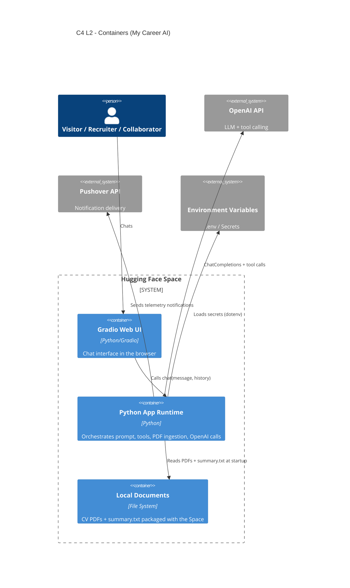

```mermaid
C4Container
title C4 L2 - Containers (My Career AI)

Person(user, "Visitor / Recruiter / Collaborator")

System_Boundary(space, "Hugging Face Space") {
  Container(gradio, "Gradio Web UI", "Python/Gradio", "Chat interface in the browser")
  Container(app, "Python App Runtime", "Python", "Orchestrates prompt, tools, PDF ingestion, OpenAI calls")
  Container(docstore, "Local Documents", "File System", "CV PDFs + summary.txt packaged with the Space")
}

System_Ext(openai, "OpenAI API", "LLM + tool calling")
System_Ext(pushover, "Pushover API", "Notification delivery")
System_Ext(env, "Environment Variables", ".env / Secrets", "API keys and tokens")

Rel(user, gradio, "Chats")
Rel(gradio, app, "Calls chat(message, history)")
Rel(app, docstore, "Reads PDFs + summary.txt at startup")
Rel(app, env, "Loads secrets (dotenv)")
Rel(app, openai, "ChatCompletions + tool calls")
Rel(app, pushover, "Sends telemetry notifications")
```
