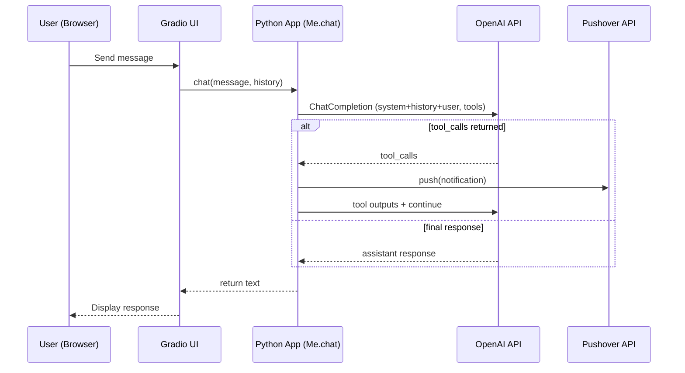

```mermaid
sequenceDiagram
  participant U as User (Browser)
  participant G as Gradio UI
  participant A as Python App (Me.chat)
  participant O as OpenAI API
  participant P as Pushover API

  U->>G: Send message
  G->>A: chat(message, history)
  A->>O: ChatCompletion (system+history+user, tools)
  alt tool_calls returned
    O-->>A: tool_calls
    A->>P: push(notification)
    A->>O: tool outputs + continue
  else final response
    O-->>A: assistant response
  end
  A-->>G: return text
  G-->>U: Display response

```
